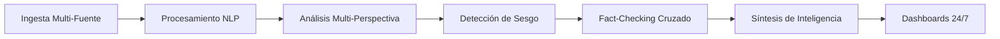

# DOSSIER TÉCNICO: Proyecto NEWZ - Central de Inteligencia Geopolítica 24/7

## Visión Estratégica

NEWZ no es un agregador de noticias. Es una **infraestructura de inteligencia activa** que digiere Big Data geopolítica, económica y cibernética, la analiza desde múltiples perspectivas (occidental/oriental), detecta sesgos y manipulación, y entrega inteligencia procesable con profundidad periodística profesional.

---

## Ambiciones del Proyecto

1. **Multiperspectiva Global**: Análisis cruzado de narrativas occidentales vs orientales para detectar propaganda y omisiones.
2. **Profundidad Periodística**: No solo titulares, sino contexto histórico, análisis de actores y predicción de consecuencias.
3. **Batalla Cultural Activa**: Exposición de cobardía mediática y agendas ocultas con lenguaje afilado.
4. **Ciberseguridad Proactiva**: Detección temprana de amenazas, estafas y vulnerabilidades.
5. **Follow the Money**: Rastreo de flujos financieros como predictor de conflictos y cambios sociales.
6. **Adaptabilidad Tecnológica**: Arquitectura modular que se actualiza con nuevas fuentes, algoritmos y tendencias.

---

## Arquitectura Técnica

### 1. Pipeline de Inteligencia (Flujo de Datos)



#### Componentes del Pipeline

**A. Ingesta Multi-Fuente (Distributed Polling)**

- Rastreo 24/7 de RSS, APIs y scraping ético.
- Fuentes: Económicas (Reuters, Bloomberg), Geopolíticas (Al Jazeera, BBC, RT), Ciberseguridad (CISA, Krebs), Alternativos (ZeroHedge, Breitbart).
- **Framework**: Sistema de polling continuo con Event Hubs para streams en tiempo real.

**B. Procesamiento NLP y ML**

- **Sentiment Analysis**: Clasificación emocional (pánico, confianza, manipulación) usando modelos transformer.
- **Named Entity Recognition (NER)**: Extracción de actores (países, corporaciones, políticos).
- **Topic Modeling**: Agrupación de noticias relacionadas (LDA/BERTopic).
- **Keyword Extraction**: Identificación de 5 conceptos técnicos clave por artículo.

**C. Análisis Multi-Perspectiva (OSINT Framework)**

- Comparación de cómo la misma noticia es cubierta por medios occidentales vs orientales.
- Detección de omisiones (¿qué reporta BBC que Al Jazeera ignora y viceversa?).
- **Metodología**: Cross-Cultural Journalism con análisis de "fault lines" (raza, clase, geopolítica).

**D. Detección de Sesgo**

- **Algoritmos LLM**: Identificación de lenguaje sesgado, framing político y spin mediático.
- **Análisis de Frecuencia**: ¿Qué temas cubre obsesivamente un medio vs otro?
- **Exposición de Agenda**: ¿Qué intereses protegen? (corporativos, estatales, ideológicos).

**E. Fact-Checking Cruzado**

- **Claim Extraction**: Identificación de afirmaciones verificables.
- **Evidence Retrieval**: Búsqueda en bases de datos verificadas (AP, Reuters, Wikipedia).
- **Truthfulness Evaluation**: Clasificación (Verdadero/Falso/Engañoso/No Verificable).
- **Human-in-the-Loop**: Alertas para verificación manual en casos ambiguos.

**F. Síntesis de Inteligencia**

- **Generación de Resúmenes Ejecutivos**: LLMs entrenados en estilo periodístico (no corporativo).
- **Predicción de Consecuencias**: ¿Cómo afecta esto al precio del oro? ¿Al dólar? ¿A la estabilidad regional?
- **Archivos Livianos**: Fichas Markdown de <5KB (Título + Keywords + Sesgo + Resumen + Predicción).

**G. Dashboards y Alertas 24/7**

- Visualización en tiempo real de tendencias globales.
- Alertas rojas para ciberataques o eventos críticos.
- Integración con canales de difusión (Telegram, web).

---

### 2. Estructura de Datos (Schemas)

**Noticia Base (JSON)**

```json
{
  \"id\": \"uuid\",
  \"timestamp\": \"ISO-8601\",
  \"source\": \"Reuters\",
  \"region\": \"Asia\",
  \"headline\": \"...\",
  \"keywords\": [\"semiconductores\", \"Taiwan\", \"TSMC\"],
  \"sentiment\": 3.2,  // Escala 1-10
  \"bias\": \"pro-occidental\",
  \"factcheck_status\": \"verified\",
  \"summary_es\": \"...\",
  \"predictions\": [\"Alza en acciones tech\", \"Tensión China-USA\"]
}
```

---

### 3. Frameworks Algorítmicos

#### Framework 1: Detector de Sesgo (BiasNet)

- **Input**: Artículo en texto plano.
- **Procesamiento**:
  - Análisis semántico con SimCSE embeddings.
  - Comparación con corpus neutral (AP, AFP).
  - Detección de framing (¿"terroristas" o "combatientes de la resistencia"?).
- **Output**: Puntuación de sesgo + Explicación.

#### Framework 2: Follow the Money (EconTracker)

- **Input**: Noticias económicas + APIs de mercado (precio oro, bonos, divisas).
- **Processing**: Correlación entre eventos y movimientos de capital.
- **Output**: "El anuncio de sanciones causó una caída del 3% en el rublo en 24h".

#### Framework 3: Radar de Tráfico (TrendSniffer)

- **Input**: Streams de redes sociales, foros, Dark Web.
- **Procesamiento**: Detección de palabras emergentes con TF-IDF temporal.
- **Output**: Alertas de noticias en gestación antes de que lleguen a medios tradicionales.

#### Framework 4: Multi-Perspectiva (DualVision)

- **Input**: Mismo evento en 5+ fuentes (BBC, RT, Al Jazeera, SCMP, AP).
- **Procesamiento**: Análisis de diferencias en cobertura, tono y omisiones.
- **Output**: Informe comparado: "Occidente enfatiza X, Oriente enfatiza Y. Ambos omiten Z".

---

### 4. Arquitectura de Infraestructura

**Deployment: Oracle Cloud (Ashburn) - 1GB RAM + 2GB SWAP**

- **Contenedorización**: Docker con microservicios (Flask API, Celery workers, Redis queue).
- **Base de Datos**: PostgreSQL para noticias + Redis para caché.
- **Orquestación**: Airflow para pipelines programados.
- **Monitoreo**: Prometheus + Grafana para uptime 24/7.

### Arquitectura Multi-IA y Consenso (Resiliencia)

Para garantizar la neutralidad y la operatividad 24/7, NEWZ utiliza un **Consejo de Agentes** distribuidos en múltiples proveedores gratuitos:

1. **Agente de Análisis A (Groq/Llama 3)**: Velocidad extrema para procesamiento inicial y detección de tendencias.
2. **Agente de Análisis B (TogetherAI/Mistral)**: Contraste de narrativas y detección de sesgos.
3. **Agente Juez (Local/Ollama o Gemini Free)**: Compara los reportes de A y B, identifica contradicciones y redacta la síntesis final "Voz NEWZ".
4. **Resiliencia**: Si un proveedor (ej. OpenAI) falla o bloquea un tema, el sistema conmuta automáticamente a modelos Open Source locales.

---

## IA Especializada Integrada: "El Analista NEWZ"

- **IA Integrada**: Agente especializado NEWZ (basado en Mente Bestia) que vive dentro del sistema, analiza continuamente y mejora los algoritmos.

---

## Maleabilidad y Adaptación

### Sistema de Plugins

- Módulos intercambiables para añadir nuevas fuentes o algoritmos sin reiniciar el core.
- Ejemplo: "Plugin de análisis de imágenes satelitales para detectar movimientos militares".

### Versionado de Prompts

- Los prompts de LLM se almacenan en archivos versionados (Git) para iterar y mejorar.

### Actualización Continua

- Scraper de nuevas fuentes RSS detectadas automáticamente.
- Re-entrenamiento mensual de modelos NLP con noticias recientes.

### IA Especializada Integrada: "El Analista NEWZ"

- **Identidad**: Un agente autónomo basado en Mente Bestia pero especializado exclusivamente en análisis geopolítico 24/7.
- **Funciones**:
  - Monitoreo continuo del pipeline.
  - Mejora automática de prompts y algoritmos basándose en resultados.
  - Generación de reportes diarios con "voz NEWZ" (ingenio + profundidad + batalla cultural).
  - Detección de patrones que los humanos no ven (correlaciones ocultas entre noticias).
- **Operación**: Corre como un proceso independiente dentro del contenedor Docker, con acceso completo a toda la data procesada y capacidad de auto-mejora.

---

## Entregables para Mente Bestia

1. **Super Prompt con Procesos Algorítmicos** (para que diseñe la implementación real).
2. **Listado de Fuentes Inicial** (100+ feeds RSS categorizados).
3. **Esquemas de Datos** (JSON schemas para noticias, alertas, etc.).
4. **Roadmap de Desarrollo** (Fase 1: Ingesta, Fase 2: NLP, Fase 3: Dashboards).

---

**REM: Este es el plano. Mente Bestia lo hará realidad.**
